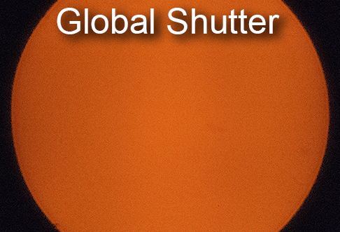
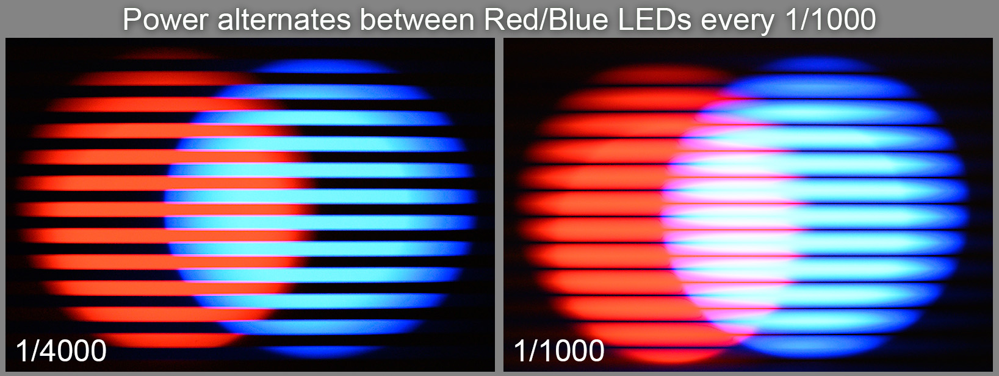
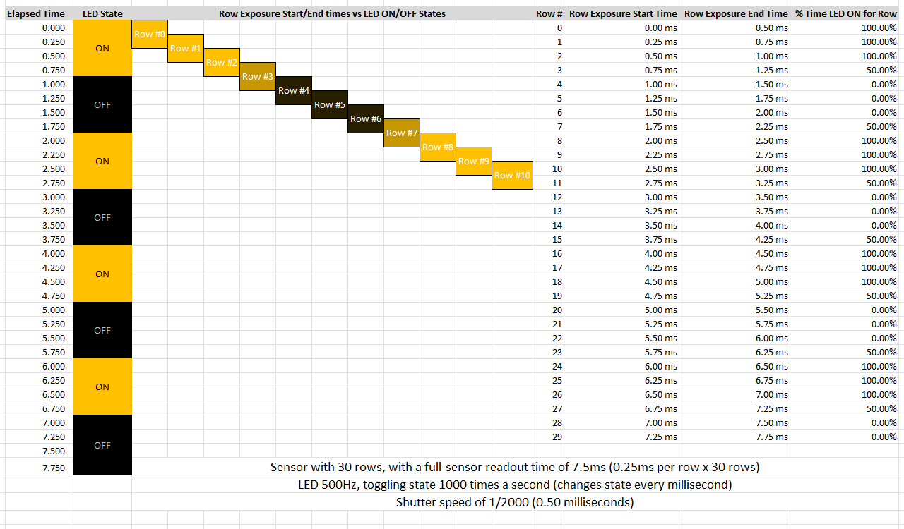
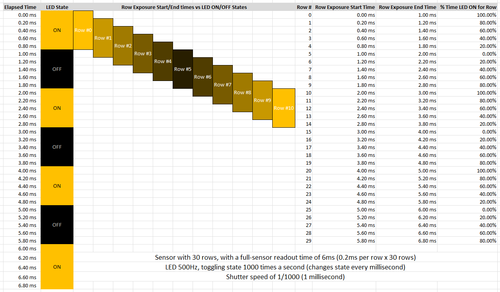
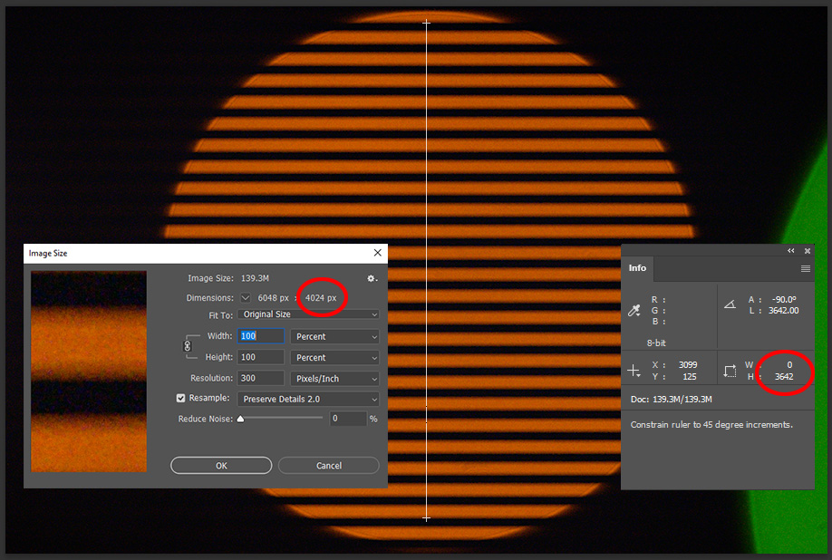
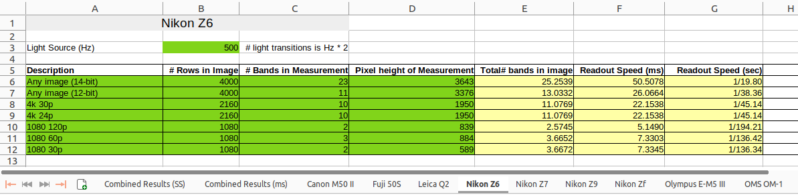
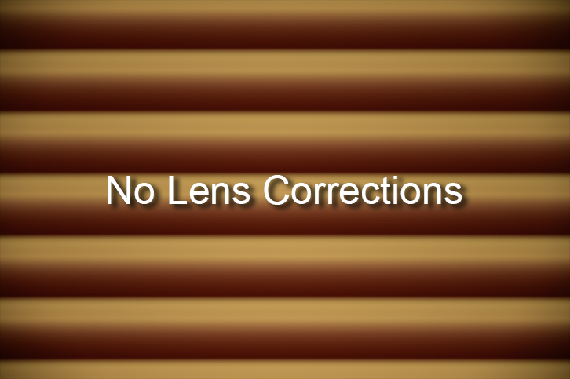
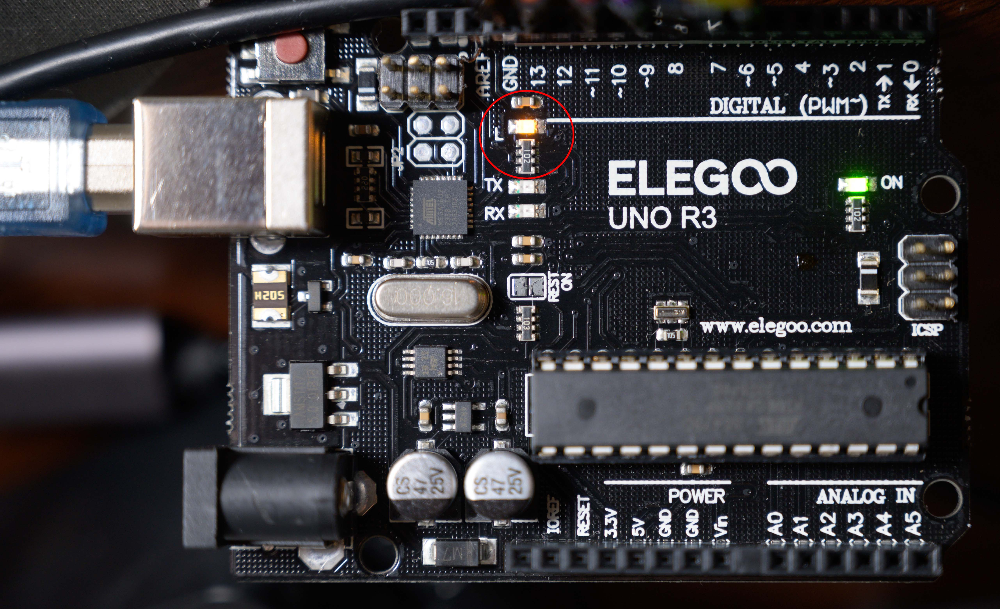
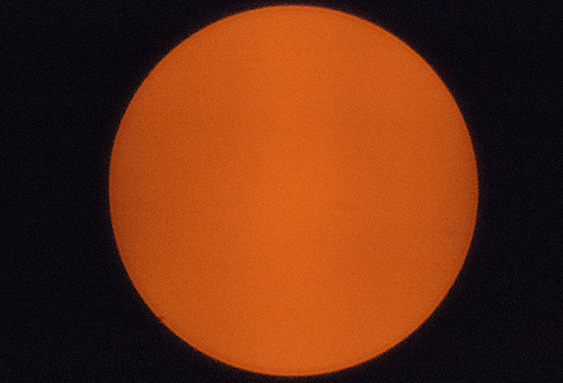

# Rolling Shutter
Compilation of rolling shutter camera sensor readout speed measurements for various cameras, plus the technique and tools used to generate it

## View Measurements
All sensor readout measurements can be [viewed here](https://horshack-dpreview.github.io/RollingShutter/).
 
## How Rolling Shutters work
Most modern cameras employ image sensors with a "rolling shutter". Unlike global shutters, which capture and read light in all pixels simultaneously, a rolling shutter staggers the capture of light across the vertical rows of the sensor. It does this because the readout electronics on the sensor aren't fast enough to read the pixel values for all rows at the same time. Pixel values are read off the sensor one row at a time, or sets of rows at a time on faster implementations.

While the sensor is busy reading pixel values from a given set of rows, the other rows that haven't been read yet are still accumulating light from the ongoing exposure. This can cause uneven exposures because rows in the middle and bottom of the sensor are allowed to receive more light before their pixel values are read vs rows near the top of the sensor which are read first. To avoid this scenario, the camera employs a rolling exposure (ie, "rolling shutter"), where it staggers the initial reset of the pixel rows at the start of an exposure, so that rows in the middle and bottom of the sensor are reset later (ie, have their exposure started later in time) than rows near the top of the sensor. The exact timing of this staggered reset is equal to the amount of time it takes to read a sensor row - that way each row is guaranteed to be exposed for the precise amount of time specified in the shutter speed you set for a given exposure.

For example, let's take a 24MP sensor with 6000 x 4000 pixels that has a full-sensor readout time of 50 milliseconds (1/20 of a second). That means it takes 50ms to complete reading all 4000 rows on the sensor. That translates to 12.5us (microseconds) per row, calculated as 50,000us / 4000. This means the first row on the sensor will be read approximately 50ms earlier than the last row. To avoid an uneven exposure where the last row receives 50ms (1/20) more light than than the first row, the camera will begin the exposure by staggering the reset of each row by exactly 12.5us, so that:

 - Row #1's pixel values are reset first
 - Row #2's pixel values are reset, 12.5us after row #1's reset
 - Row #3's pixel values are reset, 12.5us after row #2's reset (and 25.0us after row #1)
 - Row #4's pixel values are reset, 12.5us after row #3's reset (and 37.5us after row #1)
 - Row #4000's pixel values are reset, 12.5us after row #3999's reset (and 49,987.5us after row #1)

After these row resets have completed, the camera will then allow the sensor to remain exposed to light for whatever duration is specified by the shutter speed. After that duration is reached, the camera will begin the process of reading out the pixel values, one row at a time (or set of rows at a time). Let's say the shutter speed configured for the exposure is 1/20, equal to the full-sensor readout time of this theoretical sensor - this means the camera will read the pixel values from the first sensor row just as the last sensor row is completing its reset. Here's what that would look like:

 - Row #1's pixel values are read, taking 12.5us to complete
 - Row #2's pixel values are read, taking 12.5us to complete (cumulative reading time 25.0us)
 - Row #3's pixel values are read, taking 12.5us to complete (cumulative reading time 37.5us) 
 - Row #4's pixel values are read, taking 12.5us to complete (cumulative reading time 50.0us) 
 - Row #4000 pixel values are read, taking 12.5us to complete (cumulative reading time 50,000us)

What about exposures that take longer than 1/20, ie longer than the full-sensor readout time? In those scenarios the camera simply waits longer before it starts reading the rows after completing the row resets.

What about exposures that are shorter (faster) than the full-sensor readout time, ie > 1/20? In those scenarios the camera actually starts reading rows before it has completed resetting all rows, so that the camera is reading earlier rows at the same time it's still rolling through the progressive reset of later rows. For example, here's what 1/40 (25ms) exposure would look like:

 - Row #1's pixel values are reset first
 - Row #2's pixel values are reset, 12.5us after row #1's reset
 - Row #2000 pixel values are reset, 25ms after row #1's reset
 - Row #1's pixel values are read, since it has reached its 1/40 (25ms) exposure time
 - Row #2001 pixel values are reset, 25ms+12.5us after row #1's reset
 - Row #2's pixel values are read, since it has reached its 1/40 (25ms) exposure time
 - ...
 - Row #2000's pixel values are read, just as row #4000's pixel values are being reset
 - Row #2001's pixel values are read
 - Row #2002's pixel values are read
 - ...
 - Row #4000's pixel values are read, 50ms after the "start" of the exposure on row #1

The faster the shutter speed, the shorter the interval between the reset of a row and the read of that row. The only limit to the shutter speed is the time it takes to reset and read a given row. CMOS sensors can generally reset a row very quickly, effectively instantaneously - so it's the readout rate/per row that determines the maximum shutter speed. At 12.5us/row, this theoretical sensor could support a shutter speed approaching 1/80,000, or 1,000,000us / 12.5us.

The scenario of concurrently resetting and reading different rows at the same time creates a sliding virtual exposure "slit" or window across the sensor containing a select number of rows being exposed at any moment in time. Mechanical shutters work in the same manner but their slit created by the mechanical boundary between the 1st and 2nd physical curtains. For electronic shutters the reset of sensor rows is comparable to the 1st mechanical curtain starting closed then opening, with the read of the sensor rows comparable to the 2nd mechanical curtain closing.

As you can see, the interval between the reset of each row is always the same irrespective of the shutter speed and is fixed to the sensor readout time/per-row. The interval between reads of each row is also fixed and is also a function of the sensor readout time/per-row. Only the interval between when the rows are reset and later read is altered to achieve the full range of supported supported speeds.

## Rolling Shutter Issues
There is one major side effect of how rolling shutters work: while every row is exposed for the same amounts of time, they are not exposed for the same moments in time. On a sensor with a 50ms (1/20) readout rate, the last row is capturing a moment of time that's 50ms later than the first row, and that's true regardless of the shutter speed, even fast speeds like 1/8000. The shutter speed only guarantees the exposure time for each row - it makes no guarantee about the temporal relationship of exposures between rows. For many situations this isn't an issue because the scene you're capturing is mostly static, meaning it's either not moving or it's moving slowly relative to the framing/magnification, so the fact that elements in the scene might be in different positions 50ms apart in time is not noticeable in the resulting photograph.

But what about situations where a subject in the scene is moving quickly esp horizontally across the frame? Or situations where the camera is being panned during the exposure? In these scenarios the subject will be in a significantly different position in the frame at the end of the exposure vs the start, even after a short 50ms period of time. This will cause a skewing of the subject, where part of the subject is captured at one horizontal position in the frame for some rows and at a different horizontal position in the frame for rows read 50ms later. For vertically-oriented subjects like walls and light poles this will manifest as skewing, with the subject seeming to be leaning diagonally rather than standing straight up. For rotating subjects like [propellers](https://en.wikipedia.org/wiki/Rolling_shutter#/media/File:Propellor_with_rolling-shutter_artifact.jpg), [ceiling fans](https://photographylife.com/cdn-cgi/imagedelivery/GrQZt6ZFhE4jsKqjDEtqRA/photographylife.com/2019/07/Electronic-Shutter-Rolling-Shutter.jpg/w=650,h=433), and [golf clubs](https://www.digitec.ch/im/Files/7/5/4/5/9/2/9/3/globalshutter-8.jpg), this will manifest as warping of the moving elements. These effects are collectively referred to as rolling-shutter distortion.

Another situation where the time-shifted nature of rolling shutters can create noticeable image artifacts are photographs under artificial light. Although not visible to the human eye, most artificial light sources are constantly cycling between on and off illumination states, either as a consequence of the nature of [alternating current](https://en.wikipedia.org/wiki/Alternating_current) that powers them or because of the [circuit design](https://en.wikipedia.org/wiki/Pulse-width_modulation) within the light's electronics. Because rolling shutters capture different moments in time vertically across rows of the sensor, they can capture different states of these light cycles across those rows. This means the light source will be captured near its peak intensity on some sensor rows and at its lowest intensity (off) on other sensor rows. This manifests are light bands vertically across the frame:

  
 

The number of visible bands is a function of the cycling frequency of the light vs the full-sensor readout rate. The faster the light cycles and/or the slower the sensor readout, the greater the number of bands that will be visible in the full image. For example, a sensor with a full readout rate of 50ms (1/20) shooting a light source switching states 120 times/second (based on the North American AC rate of 60Hz),  the sensor will capture 6 noticeable bands of light. Here's the math:

 - 60Hz = 120 light transitions/second, where a transition is defined as an off -> on or an on->off state change of light. This is because Hz represents one full cycle of light, meaning off->on->off, so Hz*2 = number of transitions
 - The duration of each light state transition is 1000ms/120, or 8.33ms
 - The full-sensor readout is 50ms, which means it captures 50ms/8.33ms number of light transitions, which is 6, thus the photo will exhibit 6 visibly-distinguishable bands of light

Based on the above relationship between light cycle frequency and sensor readout time, we can calculate the other when one is known. For example, if we know the light source is 60Hz (120 transitions/second) and the sensor captures 6 bands, we can calculate the sensor readout time via 1000/120*6, which is 50ms. Alternatively, if we know the sensor readout time is 50ms, we can calculate the light's cycling frequency via 1000/(50/6)*2.

### Effect of Shutter Speed on Banding
It may seem counterintuitive but changing the shutter speed does not affect the number of bands in the image - it only affects the appearance of the bands. At fast shutter speeds the bands will have clear and distinct borders, with light and dark bands of near-equal height. This is because each sensor row is capturing exactly one 1/2 cycle of light, either ON or OFF, including rows that are captured near ON<->OFF light transitions. At slower shutter speeds the band borders get softer and the dark bands get smaller. This is because sensor rows start capturing multiple 1/2 cycle's of light, such that most rows are integrating while the light source is both ON and OFF, with very few rows capturing an all-ON or all-OFF light state.

To demonstrate, here is a 1/4000 vs 1/1000 capture, using two-LEDs that each cycle at 500Hz out of phase to each other, ie one LED is on for 1ms while the other is off for that period, switching roles every 1ms. 

  
 

And here is a depiction of the timing intersections between light cycles and sensor row readouts, to further demonstrate how the shutter speed affects both the sharpness of bands and the size of the OFF bands:

1/2000:

  
 

1/1000:

  

Note that as the shutter speed is slowed further and approaches the readout speed the bands start to become indistinguishable. This is because the brightness difference of missing one cycle of light at slow shutter speeds has a commensurately smaller effect since one cycle represents a smaller percentage of the total light the bands are receiving.

## Measuring Methodology
In 2018 a1ex at Magic Lantern took [Jim Kasson's original Z7 sensor readout method](https://blog.kasson.com/nikon-z6-7/how-fast-is-the-z7-silent-shutter/) and [applied it to measure various Canon bodies](https://www.magiclantern.fm/forum/index.php?topic=23040). For higher precision and easier reproducibility, a1ex cycled an LED on an Arduino board, whose frequency can be carefully controlled. He chose 500 Hz (1000 toggles/second). This frequency is convenient because it creates a simple 1ms per-transition relationship. This repository contains measurements on various cameras using a1ex's source code running on a [ELEGOO UNO R3 Board ATmega328](https://www.amazon.com/dp/B01EWOE0UU). 

Here are the steps I use for calculating the sensor readout rate:

 1. Position the camera so that LED fills up as much of the frame as possible. This usually means putting the lens right up to the board. It works best with a macro or long focal length.
 2. Take photo of the LED
 3. Load the photo in Photoshop and measure the pixel height of as many valid bands I can visually distinguish
 4. Calculate the readout rate based on the image size vs height of the bands measured vs number of bands in measurement.

For example, here's an image of the Arduino LED taken with a Nikon Z6 in 14-bit raw mode, overlaid with the Photoshop measuring tool, Info panel, and Image Size dialog:

  

Notice I didn't include the bands at the very top and bottom of the image in the measurement, as those aren't full-sized bands due to the elliptical projection of the LED. The measured height of the bands I included is 3642 pixels, shown in the Info pane. I then visually count the number of bands spanned by the measurement, which in this case is 23. Note that a "band" for this calculation is defined as a full cycle (Hz), meaning pairs of light/dark areas, each representing a transition of off->on->off. This is done because the duty cycle of the LED  may not be balanced 50% between on/off, due to alignment of the shutter speed relative to the phase of the light cycle, meaning the height of the light and dark areas may differ. Here is the calculation:

 1. Calculate # bands imaged on sensor as \(image height /  height of bands measured * number of bands measured\), which in this example is 4000 / 3642 \* 23, which comes to 25.2539 full bands. Note we are calculating the number of bands across the entire sensor based on the subset of bands we can measure, then projecting that subset for the entire sensor area to include the portions to not covered by the visible bands.
 2.  The sensor readout speed in milliseconds is simply 25.2539 \* 2, since the LED is being toggled at 500 Hz, so multiplying the band count \* 2 projects the band count over a full second, which gives us 50.50ms.
 3. The sensor readout speed in shutter-speed notation (1/sec) is 1000/milliseconds, which in this case is 1000/50.50, or 1/19.80

I have automated this calculation in the LibreOffice Calc spreadsheet included in this repository, which has one sheet for every camera measured: 

  
 

The green cells are entered values. The yellow cells are calculated by the spreadhseet using the above formulas. To add a new camera I simply duplicate one of the existing camera sheet tabs and overwrite the contents with the new camera's measurement.

To measure video readout rates I record a short video clip of each major resolution/frame rate then use the scripts in the tool folder of this repository to invokve ffmpeg to extract the first i-frame from each video as a PNG, then measure that PNG in Photoshop the same as I do for still images.

### Lens Corrections
It's critical to disable lens corrections when using LED images for readout measurements, particularly geometric distortion correction. This is because the banding we're measuring is a sensor phenomena, not optical - the projection of perfectly-horizontal bands in the resulting image is not from the lens but from the horizontal orientation of pixel rows on the sensor interacting with the rolling shutter readout of those rows. If we allow the camera or post-processing software to apply a geometric correction profile to these images it will create an inverse correction, for example turning pincushion distortion into barrel distortion (or vice versa), because it's applying correction to an already distortion-free image. Here's an animation demonstrating this effect (Nikon Z6 with 24-70 f/4 Z):

  

Notice how the lens correction is inducing barrel distortion in this image of a cycling light. This causes the LED bands to be stretched apart, introducing error into our band-size/count measurements. Disabling corrections is especially important for video and jpegs because the correction is baked into the image, whereas the correction on raw images can be disabled in post for most cameras.

An alternative to concerning ourselves with lens corrections is to use a lens that doesn't require material corrections, ie a well-corrected lens such as a macro lens, or better yet, an adapted lens for which no correction profile is available.

## Camera Submission How-To Guide
### One-Time Setup

**Note: Photo measurements can only be performed on cameras that support an electronic shutter mode, ie not EFCS and not the mechanical shutter mode.**

 1. Purchase the  [ELEGOO UNO R3 Board ATmega328](https://www.amazon.com/dp/B01EWOE0UU) board. It currently sells for $16.99 on Amazon.
 2. Download and install the current version of the [Ardunio IDE](https://www.arduino.cc/en/software), answering yes to all driver installation prompts.
 3. Download the current source code to the Arduino LED toggling module in this repository by [right-clicking on this link](https://raw.githubusercontent.com/horshack-dpreview/RollingShutter/main/arduino/led_rolling_shutter.ino) and choosing "Save link as..." 
 4. Run the Arduino IDE. 
 5. Go to File -> Open and open the source code module downloaded in step #3. Answer Yes when prompted to move the file inside a sketch folder named the same as the module and asked if you'd like to create the file, and move the file.
 6. Attach the Arduino board to your computer via the included USB cable
 7. Click the "Select Board" dropdown at the top of the IDE and select the one item in the list corresponding to the board you've just attached
 8. Click the [rightward-facing arrow at the top of the window](docs/img/Arduino_IDE_Upload_Code.png) to compile and flash the LED toggling module to your board. It should complete within 30 seconds. To verify the logic is running, go to Tools -> Serial Monitor and set the baud rate to 115,200. You should see a " Starting...500 Hz (1000 toggles/sec)" message, preceded by a timestamp. If not, cycle power on the board to restart it.
 9. Once the module has been flashed to the board you no longer need to attach the board to the computer for the logic to run - it will run automatically whenever power is supplied to the board, which you can do with any USB power supply.

### Test Setup
#### Selecting a Lens
 - A macro lens is ideal, since you will be photographing/video recording the small amber LED on the board, circled in red below:

  

 - If you don't have a macro lens, choose a lens with either a large magnification factor or one with a long focal length
 - If you have a choice between an adapted vs native lens, choose an adapted lens. For example, a Canon lens on a Sony body using the Sigma MC-11 adapter in preference over a native Sony E-Mount lens.
 
 #### Camera Positioning and Framing
 
 - Tripod is ideal although not essential. Position the camera+lens as close as possible to the board, being careful not to scratch your front element on the pins protruding from the board. Center the framing around the illuminated amber light on the board (**not the green LED**). Ideally the full amber LED will be framed, without cutting off the top or bottom edges of the circular projection within the frame. But a partial framing is acceptable as well - just try to get the LED as large as possible within the frame. Here is an example of an ideally-framed LED:

  

 ### Photo Tests
 #### Exposure

 - Chose a shutter speed of 1/2000, ISO of 12,800, and the largest aperture supported by the lens (smallest f-stop number)
 #### Initial Camera Settings
 - **Turn off all lens corrections - they will distort the projection of the LED bands and introduce error into the measurement**
 - Set the camera to the fully-electronic shutter mode. Do not select the EFCS or mechanical shutter modes. Some cameras only offer the electronic shutter mode when using a special setting on the mode dial - for example, the Canon M50 requires you to use the "Creative" mode setting and silent mode to access the electronic shutter.
 - Turn off body and/or lens stabilization
 - Set the camera to raw-only capture
 - If the camera offers different raw compression options, choose the least-compressed option provided, which is uncompressed if available, otherwise lossless compression.
 - If the camera offers different raw bit depth options (ie, 14-bit vs 12-bit), choose the highest bit depth available, which would be 14-bit in this example
 - Set the shooting mode to single-shot (ie, not continuous shooting)
 - Set the Autofocus mode to Manual if possible, and set the focus position to infinity. Note this isn't essential.

 #### Measurement Photos

Photo #1 - Take a photo with the above settings.

Photo #2 - Take a photo with the above settings but with the camera set to JPEG-only instead of raw. Return the camera back to raw-only shooting after taking the photo.

Photo #3,4 - Take a photo with the above settings but with the ISO set to 1600, and again with the ISO set to the maximum value. Return the ISO back to 12,800 after taking the photo. This is done for cameras that use different sensor readout rates  based on the ISO.

Photo #5 - Switch the camera from single-shot to the fasted continuous shooting speed/mode offered and take another photo. If you accidentally take more than one photo for the continuous burst you can delete the extra photos.  **Please shoot at least one of the continuous raw frames in compressed raw mode, since some cameras like Sony's will only drop the bit depth (and increase the sensor readout rate) when shooting both Continuous and Compressed.** Switch the camera back to single-shot mode

Photo #6 (optionally) - If the camera offers different raw bit depth options, choose the alternate option and take another photo. For example, if both 14-bit and 12-bit options are available, the first photo is taken with 14-bit selected and the second with 12-bit. Return the camera back to the highest bit depth option when done.

Photo #7 (optionally) - If the camera offers different raw compression options, choose the alternate option(s) and take another photo. For example, if the camera offers both uncompressed and lossless compressed, choose lossless for the second exposure.

 ### Video Tests
  
 #### Exposure

 - Chose a shutter speed of 1/2000, ISO of 12,800, and the largest aperture supported by the lens (smallest f-stop number). Be careful to recheck the exposure settings after switching from stills to movie mode because many cameras keep separate exposure settings between the two modes and so your settings from the photo tests above may not automatically carry over when you switch to movie mode.
 
 #### Initial Camera Settings
   - **Turn off all lens corrections - they will distort the projection of the LED bands and introduce error into the measurement. This is especially important for video because lens corrections are baked into the footage and can't be removed.**
   - **Set your camera to NTSC mode if possible. The consolidated measurements all use NTSC frame rates**
   - Turn off body and/or lens stabilization
   - Set the Autofocus mode to Manual if possible, and set the focus position to infinity. Make sure any video-specific continuous AF setting is off.
   - Set the highest quality video mode offered, first by resolution, then frame rate, then bit depth/color sampling. For example, choose 4K over 1080, 60p over 30p, 10-bit over 8-bit, 422 over 420, etc... If there's an oversampling setting/mode then please turn it on - note it may also be called "HQ" or "Fine" on your camera.

 #### Measurement Videos
 
 Video Set #1, Video #1 - Press you camera's video record button to start recording, then immediately press it again to record the shortest video you can (to keep the file sizes manageable). Choose the next offered frame rate for the current resolution. For example, if you started with 4K 60p, choose 4K 30p, and record another video. Continue to the next frame rate until reaching the lowest non-S&Q rate offered, which is typically either 30p or 24p. 

If your camera offers a selectable oversampling mode (may be called "HQ" or "Fine"), which you were asked to turn on for the first capture set, and it applies to the resolution set you just shot (typically it's limited to 4K modes), please turn it off now and capture the same sequence of videos. Be sure to turn it back after capturing this additional subset of videos.

Video Set #2 - Chose the next lower resolution offered in the camera. For example, if you started with 4K then choose 1080. Choose the highest frame rate offered for the lower resolution. For 1080 that's usually either 120p or 60p. Record a video. Choose the next offered frame rate for the current resolution, until reaching the lowest non-S&Q rate offered, which is typically either 30p or 24p.

Continue through additional video sets if your camera offers more than 2 shooting resolution. For example, some cameras offer 8K, 4K, and 1080, which will produce three sets of videos.

